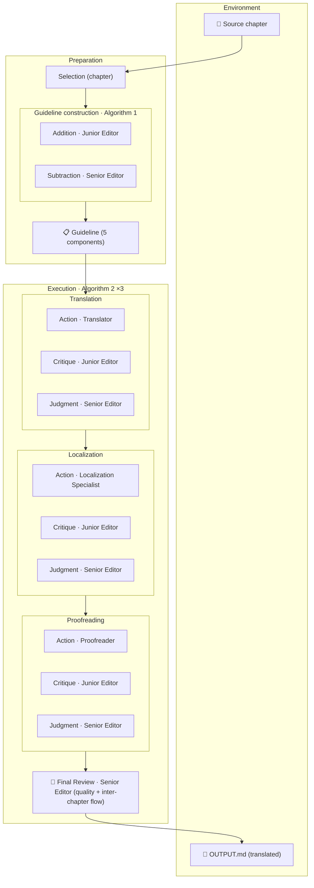

# Loop diagram

The full multi-agent translation loop. Visual reference for `book-translation-start`.

```mermaid
flowchart TD
    subgraph ENV["Environment"]
        SRC["📄 Source chapter"]
        TGT["📄 OUTPUT.md (translated)"]
    end

    subgraph PREP["Preparation"]
        SEL["Selection (chapter)"]
        subgraph PLAN["Guideline construction · Algorithm 1"]
            ADD["Addition · Junior Editor"]
            SUB["Subtraction · Senior Editor"]
        end
        GUIDE["📋 Guideline (5 components)"]
        SEL --> PLAN --> GUIDE
    end

    subgraph EXEC["Execution · Algorithm 2 ×3"]
        subgraph TRANS["Translation"]
            T_ACT["Action · Translator"]
            T_CRIT["Critique · Junior Editor"]
            T_JUDG["Judgment · Senior Editor"]
        end
        subgraph LOC["Localization"]
            L_ACT["Action · Localization Specialist"]
            L_CRIT["Critique · Junior Editor"]
            L_JUDG["Judgment · Senior Editor"]
        end
        subgraph PROOF["Proofreading"]
            P_ACT["Action · Proofreader"]
            P_CRIT["Critique · Junior Editor"]
            P_JUDG["Judgment · Senior Editor"]
        end
        FR["🔎 Final Review · Senior Editor (quality + inter-chapter flow)"]
        TRANS --> LOC --> PROOF --> FR
    end

    SRC --> SEL
    GUIDE --> TRANS
    FR --> TGT
```
