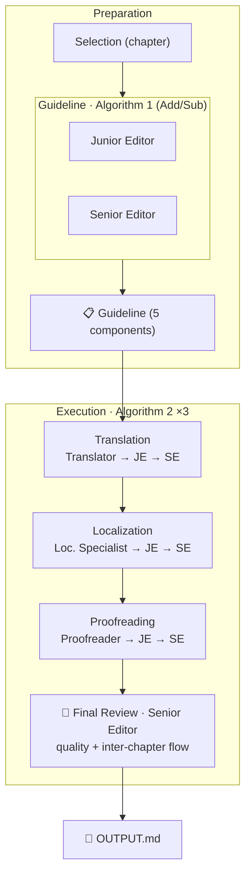

# Claude Translation Template

A template for translating long-form texts (books, memoirs, biographies) using Claude Code with a faithful implementation of the [TransAgents](https://arxiv.org/abs/2405.11804) multi-agent translation loop. Produces an mdBook website deployed to GitHub Pages.

> Reference implementation: [grandpas-book](https://github.com/jezhou/grandpas-book) — Chinese-to-English translation of a CAS fellow's memoir.

## What you get

- **Four Claude Skills** under `.claude/skills/` that encode the method — they load on demand, no boilerplate to read.
- **An mdBook + GitHub Pages pipeline** that auto-deploys your translation as a website.
- **A devcontainer** for a ready-to-use Claude Code sandbox.

## Quick start

1. **Use this as a GitHub template** (or `git clone` it).
2. **Open in Claude Code** and say: *"set up this translation project."* The `book-translation-setup` skill walks you through filling `book.toml`, the project header in `CLAUDE.md`, and generates `agent-personas.md` + `translation-bible.md`.
3. **Drop your source material** into `sources/` (a single PDF, a large `.txt`, OCR'd pages — whatever you have) and say *"ingest the source."* The `book-translation-ingest` skill detects chapters and front/back matter, shows you the proposed split, then writes per-chapter files.
4. **Translate.** Say *"translate the next chapter"* — `book-translation-start` runs the full loop and appends the result to `OUTPUT.md`.
5. **Push to `main`.** GitHub Actions builds and deploys.

## The translation loop



The skills enforce role assignments and iteration rules from the paper exactly — see `.claude/skills/book-translation-start/algorithms.md` for the pseudocode.

## Build & preview

```bash
python3 split_book.py        # regenerate book/src/ from OUTPUT.md
cd book && mdbook serve      # preview with hot-reload
```

GitHub Pages deploy is wired up in `.github/workflows/deploy.yml` and runs on every push to `main`. In repo Settings → Pages, set source to **GitHub Actions**.

## Customizing

| What | Where |
|---|---|
| Source/target language, audience | `CLAUDE.md` (one line) |
| Book metadata | `book/book.toml` |
| Agent personas | `agent-personas.md` (generated by `book-translation-setup`) |
| Translation bible | `translation-bible.md` (generated by `book-translation-setup`) |
| Chapter splitting rules | `split_book.py` (regexes near the top) |

## Credits

Built on [mdBook](https://rust-lang.github.io/mdBook/) and the TransAgents framework: Wu et al. 2024, *(Perhaps) Beyond Human Translation: Harnessing Multi-Agent Collaboration for Translating Ultra-Long Literary Texts* ([arXiv:2405.11804](https://arxiv.org/abs/2405.11804)).
