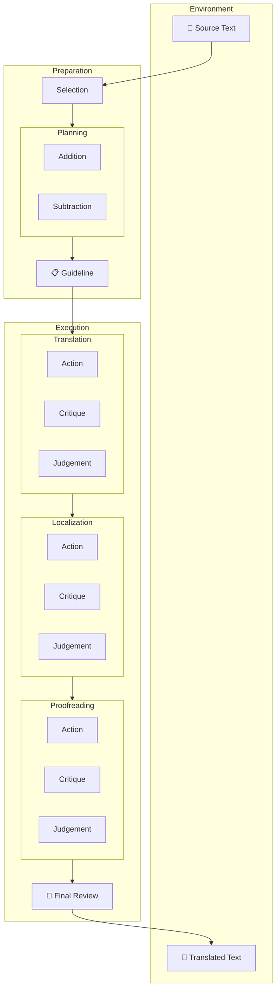

# Claude Translation Template

A template for translating long-form texts (books, memoirs, biographies) using Claude Code with a multi-agent translation loop. Produces a password-protected mdBook website, plus optional PDF/EPUB output.

> Reference implementation: [grandpas-book](https://github.com/jezhou/grandpas-book) — a Chinese-to-English translation of a CAS fellow's memoir.

## What this template gives you

- **A prescribed multi-agent loop** — Preparation → Translation → Localization → Proofreading → Final Review, each stage with Action/Critique/Judgement agents.
- **Persona scaffolding** — `templates/agent-personas.template.md` for defining agent personas tailored to your source material.
- **A translation bible** — `templates/translation-bible.template.md` for proper nouns, place names, dates, and cross-chapter consistency.
- **A build pipeline** — mdBook for the web, Pandoc for PDF/EPUB, optional AES-256 page-level encryption via [pagecrypt](https://github.com/Greenheart/pagecrypt).
- **GitHub Pages deploy** — auto-deploys on push to `main`.
- **A devcontainer** — ready-to-use Claude Code sandbox.

## Quick start

1. **Copy this directory** into a new repo (or use it as a GitHub template).
2. **Fill in the placeholders** marked `{{LIKE_THIS}}` across `CLAUDE.md`, `book/book.toml`, `package.json`, and `templates/agent-personas.template.md`.
3. **Drop source files** into `sources/` (one file per page, chapter, or logical chunk — whatever fits your material).
4. **Write your translation bible** — copy `templates/translation-bible.template.md` → `translation-bible.md` and fill in known proper nouns.
5. **Write your agent personas** — copy `templates/agent-personas.template.md` → `agent-personas.md` and tailor personas to your source (language, dialect, genre, era).
6. **Start translating** — launch Claude Code and ask it to begin the translation loop. The first pass appends to `OUTPUT.md`.
7. **Build the site** — `python3 split_book.py && npm run build`. Preview with `cd book && mdbook serve`.
8. **Deploy** — push to `main`. See the deployment section below.

## Directory layout

```
├── CLAUDE.md                       # Claude Code instructions (edit {{PLACEHOLDERS}})
├── AGENTS.md                       # Generic agent workflow notes
├── README.md                       # This file
├── templates/
│   ├── translation-bible.template.md
│   ├── agent-personas.template.md
│   └── guideline.template.md       # Per-batch translation guideline scaffold
├── sources/                        # Drop source-language files here
├── drafts/                         # Per-batch working drafts
├── OUTPUT.md                       # The canonical translated text (appended to)
├── book/                           # mdBook project
│   ├── book.toml
│   └── src/
│       └── SUMMARY.md
├── split_book.py                   # Splits OUTPUT.md into book/src/ chapters
├── encrypt-site.js                 # Optional: AES-256 encrypt the site
├── package.json
├── devcontainer.json               # Claude Code sandbox
├── .github/workflows/deploy.yml    # GitHub Pages deploy
└── examples/                       # Pointers to reference implementations
```

## The translation loop



This workflow is adapted from the TransAgents multi-agent translation paper. You can read the paper and swap it for something else — the template doesn't enforce it, but `CLAUDE.md` wires Claude to follow it by default.

## Building

### Web (mdBook)

```bash
python3 split_book.py                  # Regenerate book/src/ from OUTPUT.md
npm run build                          # Build static site → output/site/
cd book && mdbook serve                # Or preview with hot-reload
```

### Password-protected build

```bash
npm ci
BOOK_PASSWORD=yourpassword npm run build:encrypted
```

Each HTML file is AES-256-GCM encrypted client-side. No server needed. Build fails if `BOOK_PASSWORD` is unset.

### PDF / EPUB (Pandoc)

```bash
# EPUB
pandoc OUTPUT.md -o output/book.epub \
  --metadata title="{{BOOK_TITLE}}" \
  --metadata author="{{AUTHOR}}" \
  --toc

# PDF (requires a LaTeX engine)
pandoc OUTPUT.md -o output/book.pdf \
  --metadata title="{{BOOK_TITLE}}" \
  --metadata author="{{AUTHOR}}" \
  --toc --pdf-engine=xelatex
```

## Deployment

Auto-deploys to GitHub Pages on every push to `main` via `.github/workflows/deploy.yml`.

1. Repo Settings → Secrets and variables → Actions → create `BOOK_PASSWORD`
2. Repo Settings → Pages → source: **GitHub Actions**

Remove the `BOOK_PASSWORD` step from the workflow if you don't want encryption.

## Customizing for your project

| What | Where | Notes |
|---|---|---|
| Source/target language pair | `CLAUDE.md`, personas | Update every mention of source/target languages |
| Genre | `CLAUDE.md`, personas | Biography, fiction, poetry, etc. change persona emphasis |
| Source chunking strategy | `sources/` + `CLAUDE.md` | Per-page, per-chapter, per-scene |
| Chapter splitting | `split_book.py` | Default splits on `#` headings; adapt regexes for your structure |
| Agent personas | `agent-personas.md` | Native language, cultural background, era-specific knowledge |
| Book metadata | `book/book.toml`, `package.json` | Title, authors, repo URL |

## Credits

Built on top of mdBook, pagecrypt, and the TransAgents multi-agent translation framework. See `examples/` for reference implementations.
